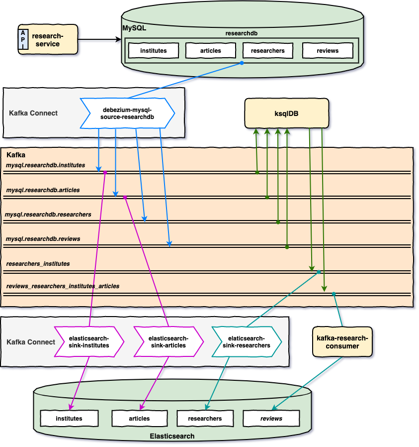

# `springboot-kafka-debezium-ksql`

The goal of this project is to play with [`Kafka`](https://kafka.apache.org), [`Debezium`](https://debezium.io/) and
[`KSQL`](https://www.confluent.io/product/ksql/). For this, we have: `research-service` that inserts/updates/deletes
records in [`MySQL`](https://www.mysql.com); `Source Connectors` that monitor change of records in MySQL and push
messages related to those changes to Kafka; `Sink Connectors` and `kafka-research-consumer` that listen messages from
Kafka and insert/update documents in [`Elasticsearch`](https://www.elastic.co); finally, `KSQL-Server` that listens
some topics in Kafka, does some joins and pushes new messages to new topics in Kafka.

# Microservices



## research-service

Monolithic spring-boot application that exposes a REST API to manage `Institutes`, `Articles`, `Researchers` and
`Reviews`. The data is saved in `MySQL`. Besides, if the service runs with the profile `simulation`, it will
_"simulate"_ an automatic and random creation of reviews.

## kafka-research-consumer

Spring-boot application that listens messages from the topic `REVIEWS_RESEARCHERS_INSTITUTES_ARTICLES` (that is one of
`KSQL` outputs) and save the payload of those messages (i.e, reviews with detailed information) in `Elasticsearch`.

# Start Environment

## Docker Compose

1. Open one terminal

2. Inside `/springboot-kafka-debezium-ksql` root folder run

```
docker-compose up -d
```
> During the first run, an image for `mysql` and `kafka-connect`will be built, whose names are
> `springboot-kafka-debezium-ksql_mysql` and `springboot-kafka-debezium-ksql_kafka-connect`, respectively.
> To rebuild those images run
> ```
> docker-compose build
> ```
> To stop and remove containers, networks and volumes type:
> ```
> docker-compose down -v
> ```

3. Wait a little bit until all containers are `Up (healthy)`. To check the status of the containers, run
```
docker-compose ps
```

## Create connectors (3/4)

1. In a terminal, run the following `curl` commands to create `debezium` and 2 `elasticsearch-sink` connectors on `kafka-connect`
```
curl -i -X POST http://localhost:8083/connectors -H 'Content-Type: application/json' -d @connectors/debezium-mysql-source-researchdb.json
curl -i -X POST http://localhost:8083/connectors -H 'Content-Type: application/json' -d @connectors/elasticsearch-sink-institutes.json
curl -i -X POST http://localhost:8083/connectors -H 'Content-Type: application/json' -d @connectors/elasticsearch-sink-articles.json
```

2. You can check the state of the connectors and their tasks on `Kafka Connect UI` (http://localhost:8086) or calling
kafka-connect endpoint
```
curl localhost:8083/connectors/debezium-mysql-source-researchdb/status
curl localhost:8083/connectors/elasticsearch-sink-institutes/status
curl localhost:8083/connectors/elasticsearch-sink-articles/status
```

3. The state of the connectors and their tasks must be `RUNNING`

4. If there is any problem, you can check `kafka-connect` container logs.
```
docker logs kafka-connect -f
```

## Run research-service

There are two ways to run `research-service`: **REST API** or **Batch Simulation**

### REST API

In a new terminal, run the command below inside `/springboot-kafka-debezium-ksql` root folder. It will start
the service as a REST API
```
./mvnw spring-boot:run --projects research-service
```
The Swagger link is http://localhost:9080/swagger-ui.html

> **Note**: if you pick this way, create at least one `review` on `Review-Controller` > `POST /api/reviews` so that
> the topic `mysql.researchdb.reviews` is created on Kafka. Otherwise, you will have the following exception while
> running `ksql-cli`
> ```
> io.confluent.ksql.parser.exception.ParseFailedException: Exception while processing statement: Avro schema for message
> values on topic mysql.researchdb.reviews does not exist in the Schema Registry.
> ```

### Batch Simulation

This mode will create automatically and randomly a certain number of reviews. The parameters available are:

| parameter | default | description |
| --------- | ------- | ----------- |
| `simulation.reviews.total` | `10` | total number of reviews to be created |
| `simulation.reviews.sleep` | `100` | sleep time (in milliseconds) between the creation of reviews |

Inside `/springboot-kafka-debezium-ksql/research-service`, you can run the simulation, for example, changing the
default values
```
./mvnw spring-boot:run --projects research-service \
  -Dspring-boot.run.jvmArguments="-Dspring.profiles.active=simulation -Dsimulation.reviews.total=100 -Dsimulation.reviews.sleep=0"
```

## Run ksql-cli

1. In a new terminal, inside `/springboot-kafka-debezium-ksql` root folder, run the `docker` command below to start `ksql-cli`
```
docker run -it --rm --name ksql-cli \
  --network springboot-kafka-debezium-ksql_default \
  -v $PWD/docker/ksql/researchers-institutes.ksql:/tmp/researchers-institutes.ksql \
  -v $PWD/docker/ksql/reviews-researchers-institutes-articles.ksql:/tmp/reviews-researchers-institutes-articles.ksql \
  confluentinc/cp-ksql-cli:5.1.0 http://ksql-server:8088
```

2. On `ksql-cli` command line, run the following commands

- Set `auto.offset.reset` value
```
SET 'auto.offset.reset' = 'earliest';
```

- Run the following script. It will create `RESEARCHERS_INSTITUTES` topic
```
RUN SCRIPT '/tmp/researchers-institutes.ksql';
```

- check whether the topic was created 
```
DESCRIBE RESEARCHERS_INSTITUTES;
SELECT * from RESEARCHERS_INSTITUTES LIMIT 5;
```

- Run the script below. It will create `REVIEWS_RESEARCHERS_INSTITUTES_ARTICLES` topic
```
RUN SCRIPT '/tmp/reviews-researchers-institutes-articles.ksql';
```

- check whether the topic was created
```
DESCRIBE REVIEWS_RESEARCHERS_INSTITUTES_ARTICLES;
SELECT * from REVIEWS_RESEARCHERS_INSTITUTES_ARTICLES LIMIT 5;
```

## Create connectors (4/4)

1. In a terminal, run the `curl` command below to create `elasticsearch-sink-researchers` connector on `kafka-connect`
```
curl -i -X POST http://localhost:8083/connectors -H 'Content-Type: application/json' -d @connectors/elasticsearch-sink-researchers.json
```

2. You can check the state of the connectors and their tasks on `Kafka Connect UI` (http://localhost:8086) or calling
kafka-connect endpoint
```
curl localhost:8083/connectors/elasticsearch-sink-researchers/status
```

## Run kafka-research-consumer

In a new terminal, run the command below inside `/springboot-kafka-debezium-ksql` root folder
```
./mvnw spring-boot:run --projects kafka-research-consumer
```

## Check records in Elasticsearch

- Get all indices 
```
curl localhost:9200/_cat/indices?v
```

- Search for documents
```
curl localhost:9200/articles/_search?pretty
curl localhost:9200/institutes/_search?pretty
curl localhost:9200/researchers/_search?pretty
curl localhost:9200/reviews/_search?pretty
```

# Useful commands

### MySQL
```
docker exec -it mysql bash -c 'mysql -uroot -psecret'
use researchdb;
SELECT a.id AS review_id, c.id AS article_id, c.title AS article_title, b.id AS reviewer_id, b.first_name, b.last_name, b.institute_id, a.comment \
  FROM reviews a, researchers b, articles c \
  WHERE a.researcher_id = b.id and a.article_id = c.id;
```

# TODO

1. Create indices dynamically and add an `alias` for them.

2. Fix the UPPERCASE field names that `KSQL` is generating. It is possible using double-quotes but, tried and it breaks
the `CREATE STREAM`.
`Allow statement to specify the casing (camel case, uppercase, etc) for field names when serialized to output topic #1039` https://github.com/confluentinc/ksql/issues/1039

2. Replace the deprecated `topic.index.map` configured in `elasticsearch-sink-*` connectors:
Waiting for those `kafka-connect-elasticsearch` issues to be fixed:
- `Create indices before writing records #261` https://github.com/confluentinc/kafka-connect-elasticsearch/pull/261
- `ConnectException: Cannot create mapping when using RegexRouter/TimestampRouter SMT #99` https://github.com/confluentinc/kafka-connect-elasticsearch/issues/99

# References

- https://docs.confluent.io/current/ksql/docs/tutorials/basics-docker.html#ksql-quickstart-docker